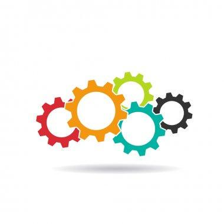
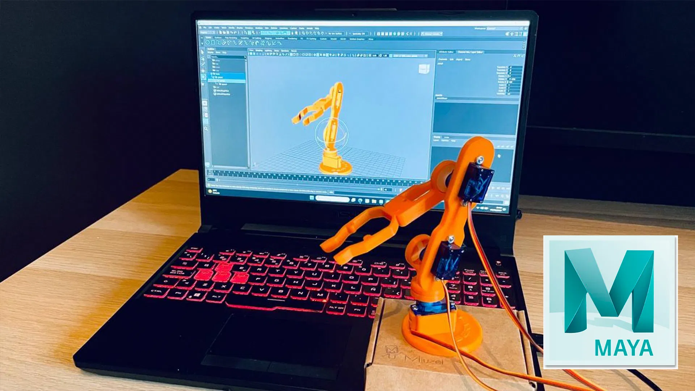

<!-- Improved compatibility of back to top link: See: https://github.com/othneildrew/Best-README-Template/pull/73 -->

<!--
*** Thanks for checking out the Best-README-Template. If you have a suggestion
*** that would make this better, please fork the repo and create a pull request
*** or simply open an issue with the tag "enhancement".
*** Don't forget to give the project a star!
*** Thanks again! Now go create something AMAZING! :D
-->

<!-- PROJECT SHIELDS -->
<!--
*** I'm using markdown "reference style" links for readability.
*** Reference links are enclosed in brackets [ ] instead of parentheses ( ).
*** See the bottom of this document for the declaration of the reference variables
*** for contributors-url, forks-url, etc. This is an optional, concise syntax you may use.
*** https://www.markdownguide.org/basic-syntax/#reference-style-links
-->
[![MIT License][license-shield]][license-url]
[![LinkedIn][linkedin-shield]][linkedin-url]

<!-- PROJECT LOGO -->
 

  

  <h3 align="center">Arduino to Maya libraries</h3>
  <h3 align="center">ManuDevTools</h3>

  

    Scripts to attach an output from an Arduino pin to a Maya Attribute
     
    <a href="https://github.com/ManuDevTools/Arduino_TaikoArcadeController"><strong>Explore the docs »</strong></a>
     
     
    <a href="https://www.youtube.com/channel/UCZrp9AK2TuKEl2BZkwJ5y3Q">View Demo</a>
    ·
    <a href="https://github.com/ManuDevTools/Arduino_MidiMasterClock/issues">Report Bug</a>
    ·
    <a href="https://github.com/ManuDevTools/Arduino_MidiMasterClock/issues">Request Feature</a>
  

<!-- TABLE OF CONTENTS -->

  
Table of Contents

  <ol>
    <li>
      <a href="#about-the-project">About The Project</a>
    </li>
    <li><a href="#usage">Usage</a></li>
    <li><a href="#license">License</a></li>
    <li><a href="#contact">Contact</a></li>
  </ol>

<!-- ABOUT THE PROJECT -->
## About The Project

 
Arduino 2 Maya are libraries I have developed to facilitate communication between the 3D software Maya and an Arduino board, allowing the use of external sensors in Maya.

These libraries open up new possibilities for interacting with the software, enabling quick and easy configuration and adaptation of its functionalities.

This experimental project allows, for example, controlling scene elements like a camera rig using various devices such as potentiometers or distance sensors.

This robotic arm was 3D printed and assembled with 3 servo motors. Using the 3D files, I created a small functional rig in Maya to connect its rotation attributes to the servo motor angles. By adjusting their origin positions and orientations, the values in Maya reflect 1:1 with those of the arm. Using my Arduino2Maya libraries, I was able to control it in real-time through Autodesk's Maya software.

Feel free to use it and modify it as you need.

If you've found it useful, please consider star the project or a fork.
Thank you!

  

(<a href="#readme-top">back to top</a>)

### Built With

    

(<a href="#readme-top">back to top</a>)

<!-- LICENSE -->
## License

Distributed under the MIT License. See `LICENSE.txt` for more information.

(<a href="#readme-top">back to top</a>)

<!-- CONTACT -->
## Contact

LinkedIn - [@LinkedIn](https://www.linkedin.com/in/manuelspk/)

Project Link: [https://github.com/ManuDevTools/Maya_ArduinoToMaya](https://github.com/ManuDevTools/Maya_ArduinoToMaya)

(<a href="#readme-top">back to top</a>)

<!-- MARKDOWN LINKS & IMAGES -->
<!-- https://www.markdownguide.org/basic-syntax/#reference-style-links -->
[contributors-shield]: https://img.shields.io/github/contributors/othneildrew/Best-README-Template.svg?style=for-the-badge
[contributors-url]: https://github.com/ManuDevTools/Maya_FrameSwitcher/graphs/contributors
[forks-shield]: https://img.shields.io/github/forks/othneildrew/Best-README-Template.svg?style=for-the-badge
[forks-url]: https://github.com/ManuDevTools/Maya_FrameSwitcher/network/members
[stars-shield]: https://img.shields.io/github/stars/othneildrew/Best-README-Template.svg?style=for-the-badge
[stars-url]: https://github.com/ManuDevTools/Maya_FrameSwitcher/stargazers
[issues-shield]: https://img.shields.io/github/issues/othneildrew/Best-README-Template.svg?style=for-the-badge
[issues-url]: https://github.com/ManuDevTools/Maya_FrameSwitcher/issues
[license-shield]: https://img.shields.io/github/license/othneildrew/Best-README-Template.svg?style=for-the-badge
[license-url]: https://github.com/ManuDevTools/Maya_FrameSwitcher/blob/master/LICENSE.txt
[linkedin-shield]: https://img.shields.io/badge/-LinkedIn-black.svg?style=for-the-badge&logo=linkedin&colorB=555
[linkedin-url]: https://linkedin.com/in/manuelspk/
[product-screenshot]: images/screenshot.png
[Next.js]: https://img.shields.io/badge/next.js-000000?style=for-the-badge&logo=nextdotjs&logoColor=white
[Next-url]: https://nextjs.org/
[React.js]: https://img.shields.io/badge/React-20232A?style=for-the-badge&logo=react&logoColor=61DAFB
[React-url]: https://reactjs.org/
[Vue.js]: https://img.shields.io/badge/Vue.js-35495E?style=for-the-badge&logo=vuedotjs&logoColor=4FC08D
[Vue-url]: https://vuejs.org/
[Angular.io]: https://img.shields.io/badge/Angular-DD0031?style=for-the-badge&logo=angular&logoColor=white
[Angular-url]: https://angular.io/
[Svelte.dev]: https://img.shields.io/badge/Svelte-4A4A55?style=for-the-badge&logo=svelte&logoColor=FF3E00
[Svelte-url]: https://svelte.dev/
[Laravel.com]: https://img.shields.io/badge/Laravel-FF2D20?style=for-the-badge&logo=laravel&logoColor=white
[Laravel-url]: https://laravel.com
[Bootstrap.com]: https://img.shields.io/badge/Bootstrap-563D7C?style=for-the-badge&logo=bootstrap&logoColor=white
[Bootstrap-url]: https://getbootstrap.com
[JQuery.com]: https://img.shields.io/badge/jQuery-0769AD?style=for-the-badge&logo=jquery&logoColor=white
[JQuery-url]: https://jquery.com 
